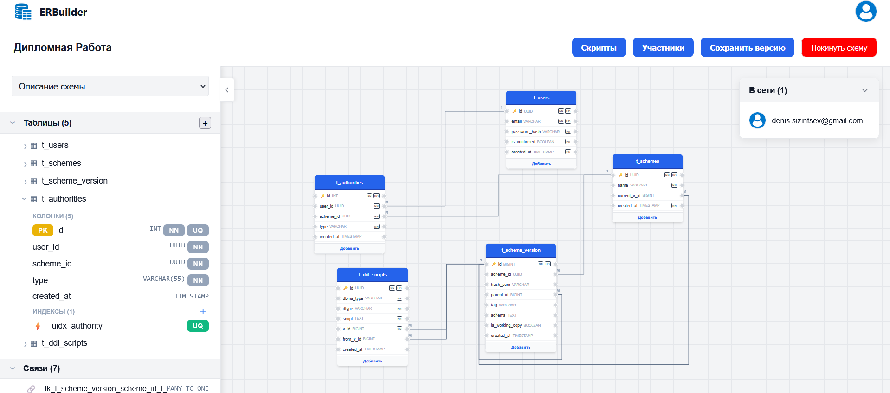
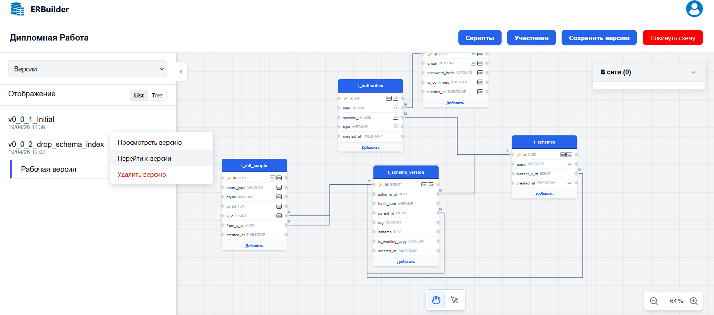
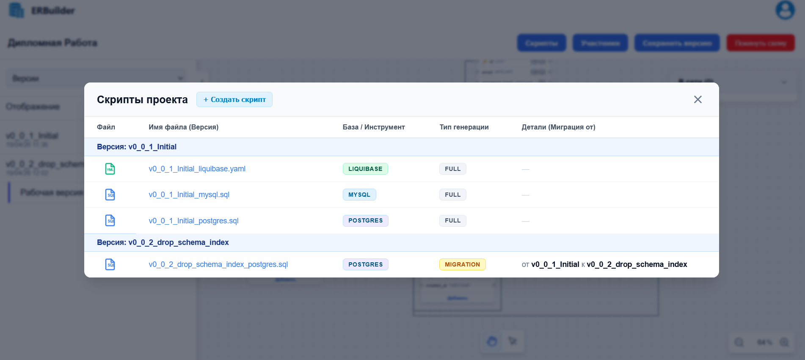
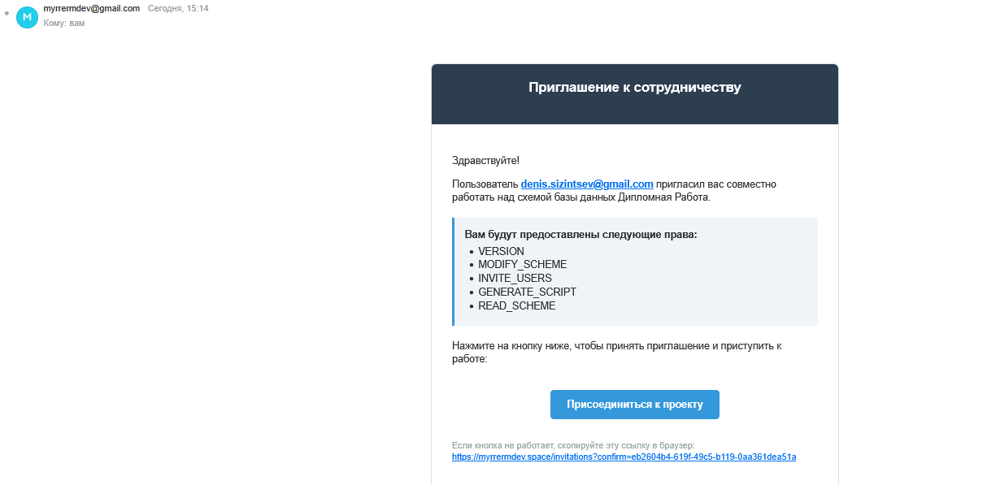
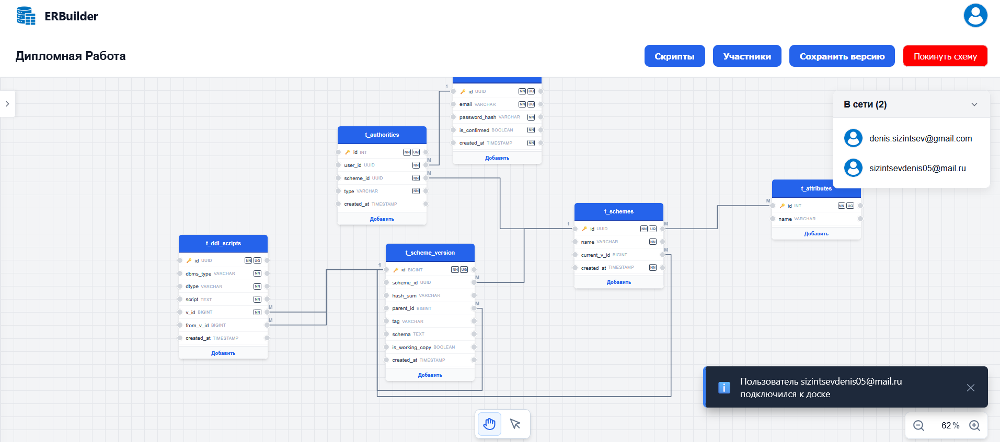

# ERBuilder
Дипломная работа: **_Кооперативная система для разработки схем баз данных_**

## Содержание
- [Технологии](#технологии)
- [Функционал](#функционал)
- [Пример работы](#пример-работы)
- [ToDo](#to-do)
- [Запуск проекта](#запуск-проекта)

## Технологии


 

 \


## Функционал

#### Создание схем


#### Версионирование


### Генерация скриптов


_Пример сгенерированных скриптов (Postgres):_

``` postgresql
/*
	Generated by ErmDev. Version tag: v0_0_1_Initial
*/
CREATE TABLE IF NOT EXISTS t_users(
	id uuid NOT NULL,
	email varchar(100) NOT NULL,
	password_hash varchar(255) NOT NULL,
	is_confirmed boolean NOT NULL DEFAULT false,
	created_at timestamp NOT NULL DEFAULT NOW(),
	CONSTRAINT uq_t_users_id UNIQUE (id),
	CONSTRAINT uq_t_users_email UNIQUE (email),
	CONSTRAINT pk_t_users PRIMARY KEY (id)
);

CREATE TABLE IF NOT EXISTS t_schemes(
	id uuid NOT NULL,
	name varchar(100) NOT NULL,
	current_v_id bigint,
	created_at timestamp NOT NULL DEFAULT NOW(),
	CONSTRAINT uq_t_schemes_id UNIQUE (id),
	CONSTRAINT pk_t_schemes PRIMARY KEY (id)
);

CREATE TABLE IF NOT EXISTS t_scheme_version(
	id bigserial NOT NULL,
	scheme_id uuid,
	hash_sum varchar(256),
	parent_id bigint,
	tag varchar(55),
	schema text,
	is_working_copy boolean DEFAULT true,
	created_at timestamp DEFAULT NOW(),
	CONSTRAINT uq_t_scheme_version_id UNIQUE (id),
	CONSTRAINT pk_t_scheme_version PRIMARY KEY (id)
);

CREATE UNIQUE INDEX uidx_scheme_id_tag ON t_scheme_version USING btree (scheme_id, tag);

CREATE UNIQUE INDEX uidx_scheme_id_hash ON t_scheme_version USING btree (scheme_id, hash_sum);

CREATE TABLE IF NOT EXISTS t_authorities(
	id serial NOT NULL,
	user_id uuid NOT NULL,
	scheme_id uuid NOT NULL,
	type varchar(55) NOT NULL,
	created_at timestamp DEFAULT NOW(),
	CONSTRAINT uq_t_authorities_id UNIQUE (id),
	CONSTRAINT pk_t_authorities PRIMARY KEY (id)
);

CREATE UNIQUE INDEX uidx_authority ON t_authorities USING btree (user_id, scheme_id, type);

CREATE TABLE IF NOT EXISTS t_ddl_scripts(
	id uuid NOT NULL,
	dbms_type varchar(55) NOT NULL,
	dtype varchar(31) NOT NULL,
	script text NOT NULL,
	v_id bigint NOT NULL,
	from_v_id bigint,
	created_at timestamp DEFAULT NOW(),
	CONSTRAINT uq_t_ddl_scripts_id UNIQUE (id),
	CONSTRAINT pk_t_ddl_scripts PRIMARY KEY (id)
);

ALTER TABLE t_scheme_version
ADD CONSTRAINT fk_t_scheme_version_scheme_id_t_schemes_id
FOREIGN KEY (scheme_id)
REFERENCES t_schemes (id)
ON DELETE NO ACTION
ON UPDATE NO ACTION;

ALTER TABLE t_scheme_version
ADD CONSTRAINT fk_t_scheme_version_parent_id_t_scheme_version_id
FOREIGN KEY (parent_id)
REFERENCES t_scheme_version (id)
ON DELETE SET NULL
ON UPDATE NO ACTION;

ALTER TABLE t_schemes
ADD CONSTRAINT fk_t_schemes_current_v_id_t_scheme_version_id
FOREIGN KEY (current_v_id)
REFERENCES t_scheme_version (id)
ON DELETE NO ACTION
ON UPDATE NO ACTION;

ALTER TABLE t_authorities
ADD CONSTRAINT fk_t_authorities_user_id_t_users_id
FOREIGN KEY (user_id)
REFERENCES t_users (id)
ON DELETE CASCADE
ON UPDATE NO ACTION;

ALTER TABLE t_authorities
ADD CONSTRAINT fk_t_authorities_scheme_id_t_schemes_id
FOREIGN KEY (scheme_id)
REFERENCES t_schemes (id)
ON DELETE CASCADE
ON UPDATE NO ACTION;

ALTER TABLE t_ddl_scripts
ADD CONSTRAINT fk_t_ddl_scripts_v_id_t_scheme_version_id
FOREIGN KEY (v_id)
REFERENCES t_scheme_version (id)
ON DELETE CASCADE
ON UPDATE NO ACTION;

ALTER TABLE t_ddl_scripts
ADD CONSTRAINT fk_t_ddl_scripts_from_v_id_t_scheme_version_id
FOREIGN KEY (from_v_id)
REFERENCES t_scheme_version (id)
ON DELETE CASCADE
ON UPDATE NO ACTION;
```

_Пример сгенерированной миграции:_

```postgresql
/*
	Generated by ErmDev. Version tag: v0_0_3_attributes
*/
DROP INDEX uidx_scheme_id_tag;

CREATE TABLE IF NOT EXISTS t_attributes(
	id serial NOT NULL,
	name varchar(55),
	CONSTRAINT uq_t_attributes_id UNIQUE (id),
	CONSTRAINT pk_t_attributes PRIMARY KEY (id)
);

CREATE TABLE IF NOT EXISTS mtm_t_schemes_t_attributes(
	t_schemes_id uuid,
	t_attributes_id integer,
	CONSTRAINT pk_mtm_t_schemes_t_attributes PRIMARY KEY (t_schemes_id, t_attributes_id)
);

ALTER TABLE mtm_t_schemes_t_attributes
ADD CONSTRAINT fk_mtm_t_schemes_t_attributes_t_schemes_id_t_schemes_id
FOREIGN KEY (t_schemes_id)
REFERENCES t_schemes (id)
ON DELETE CASCADE
ON UPDATE NO ACTION;

ALTER TABLE mtm_t_schemes_t_attributes
ADD CONSTRAINT fk_mtm_t_schemes_t_attributes_t_attributes_id_t_attributes_id
FOREIGN KEY (t_attributes_id)
REFERENCES t_attributes (id)
ON DELETE CASCADE
ON UPDATE NO ACTION;
```

#### Приглашение пользователей и кооперативная работа





## To do
- [ ] Реализовать отмену действий
- [ ] Добавить поддержку составных типов
- [ ] Добавить поддержку Sequence

## Запуск проекта
```shell
docker compose up --build -d
```